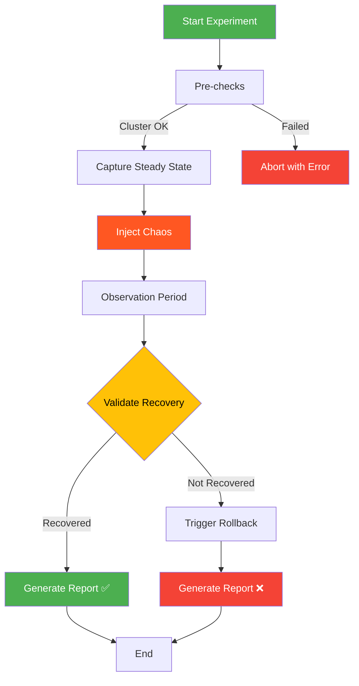

# Chaos Engineering Toolkit

[\](https://github.com/shivajichaprana/chaos-engineering-toolkit/actions/workflows/chaos-ci.yml)
[\](LICENSE)

Lightweight Kubernetes chaos engineering framework with pod failure, network chaos, and node drain experiments. Built on pure Bash with zero external dependencies beyond kubectl.

## Why This Exists

Teams assume Kubernetes self-heals, but never test it. When a node fails or a pod gets OOM-killed during peak traffic, they discover their readiness probes, PDBs, and autoscaling configs were wrong all along. This toolkit lets you validate resilience assumptions before production incidents do it for you.

## Experiment Flow



## Experiment Catalog

| Experiment | Description | Validates | Blast Radius |
|-----------|-------------|-----------|-------------|
| [pod-failure](experiments/pod-failure/) | Randomly deletes pods from a target deployment | Pod rescheduling, readiness probes, service continuity | Single pod |
| [network-chaos](experiments/network-chaos/) | Injects network latency using tc traffic control | Timeout handling, circuit breakers, degraded mode | All pods on target node |
| [node-drain](experiments/node-drain/) | Cordons and drains a worker node | PDB compliance, pod rescheduling, multi-node resilience | Entire node |

## Prerequisites

- [Kind](https://kind.sigs.k8s.io/) v0.20+
- [kubectl](https://kubernetes.io/docs/tasks/tools/) v1.27+
- [Docker](https://docs.docker.com/get-docker/) 24+
- [Helm](https://helm.sh/) v3 (optional, for Prometheus/Grafana monitoring)
- [BATS](https://github.com/bats-core/bats-core) (optional, for running tests)

## Quick Start

```bash
# 1. Clone the repo
git clone https://github.com/shivajichaprana/chaos-engineering-toolkit.git
cd chaos-engineering-toolkit

# 2. Create a local Kind cluster with sample app deployed
./scripts/setup-cluster.sh

# 3. (Optional) Set up monitoring stack
./scripts/setup-cluster.sh --with-monitoring

# 4. Run a single experiment
./experiments/pod-failure/experiment.sh

# 5. Run all experiments sequentially with a combined report
./scripts/run-all.sh
```

## Architecture

```
chaos-engineering-toolkit/
├── .github/workflows/
│   └── chaos-ci.yml              # CI: shellcheck, BATS, kubeval
├── lib/                          # Shared framework libraries
│   ├── experiment_runner.sh      # Experiment lifecycle manager
│   ├── steady_state.sh          # Steady-state capture & validation
│   └── report_generator.sh      # Markdown report generation
├── experiments/                  # Individual chaos experiments
│   ├── pod-failure/             # Random pod deletion
│   ├── network-chaos/           # Network latency injection via tc
│   └── node-drain/             # Node cordon & drain
├── manifests/                    # Kubernetes manifests
│   ├── sample-app/              # Target application (nginx)
│   └── network-chaos/           # tc-injector DaemonSet
├── dashboards/
│   └── chaos-experiment.json    # Grafana monitoring dashboard
├── scripts/
│   ├── setup-cluster.sh         # Kind cluster bootstrap
│   └── run-all.sh               # Experiment orchestrator
├── tests/                        # BATS unit tests
│   ├── test_experiment_runner.bats
│   └── test_report_generator.bats
├── docs/
│   └── experiment-guide.md      # How to write new experiments
├── kind-config.yaml             # Kind cluster configuration
├── Makefile                     # Build targets
└── CONTRIBUTING.md              # Contribution guidelines
```

## Configuration

Experiments are configured via environment variables or `config.yaml` files in each experiment directory:

| Variable | Description | Default |
|----------|-------------|---------|
| `TARGET_NAMESPACE` | Kubernetes namespace | `chaos-sandbox` |
| `TARGET_DEPLOYMENT` | Target deployment name | `sample-app` |
| `RECOVERY_TIMEOUT` | Seconds to wait for recovery | `120` |
| `POLL_INTERVAL` | Seconds between validation checks | `5` |
| `HEALTH_ENDPOINT` | HTTP endpoint for health checks | _(none)_ |
| `OBSERVATION_PERIOD` | Seconds to observe after injection | `0` |

## Running Tests

```bash
# Run all tests
make test

# Run shellcheck linting
make lint

# Run everything (lint + test)
make all
```

## Sample Report Output

After running an experiment, a Markdown report is generated in the experiment directory:

```
## Chaos Experiment Report: pod-failure
**Date:** 2024-04-16T14:32:00Z
**Status:** ✅ PASSED

### Steady State (Before)
- Pod Count: 3/3
- Endpoints Ready: 3
- Health Check: HTTP 200 (42ms)

### Chaos Injection
- Action: Deleted pod sample-app-7d4f8b6c9-x2k4p
- Duration: 45s observation period

### Recovery Validation
- Pod Count: 3/3 (recovered in 12s)
- Endpoints Ready: 3
- Health Check: HTTP 200 (38ms)

### Verdict
System recovered within acceptable threshold (12s < 120s timeout).
```

## Monitoring

Import `dashboards/chaos-experiment.json` into Grafana for real-time experiment monitoring. The dashboard tracks pod availability, network latency percentiles, node status, and experiment lifecycle events. See the [experiment guide](docs/experiment-guide.md) for details on setting up the monitoring stack.

## Writing New Experiments

See the [Experiment Authoring Guide](docs/experiment-guide.md) for step-by-step instructions on creating custom experiments using the framework.

## Contributing

See [CONTRIBUTING.md](CONTRIBUTING.md) for development setup, coding standards, and pull request guidelines.

## License

MIT License — see [LICENSE](LICENSE) for details.
